# Ache life-to-comic skill

<p align="center">
  
</p>

<p align="center">
  <strong>把今天收进一本会继续长大的漫画里。</strong>
</p>

一句话、一张照片、一段会议，或者一篇不想改的长文。第一次创刊后，接下来只管发来。每次记录会拥有自己的封面和页法，再续进当月的漫画手帐。

不是把所有内容塞进同一张模板，也不要求你天天都有故事。有时是三格漫画，有时是一页照片手帐，有时只需要文字和一幅很小的图。

## 效果演示：先翻开看看

<p align="center">
  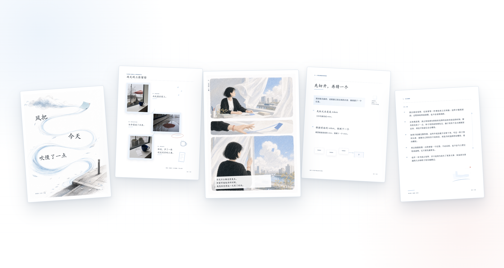
</p>

下面使用示例内容与生成画面，展示不同输入会怎样排版。

<table>
  <tr>
    <td width="50%" valign="top">
      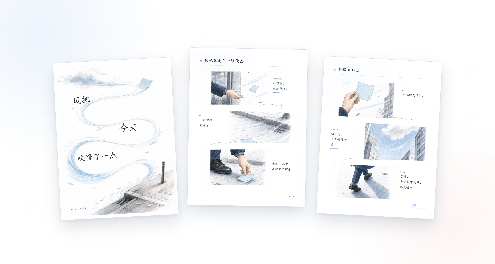
      <br><strong>日常与心情</strong>
      <br>从一句小事里找到动作和情绪。该三格的时候就三格，该留白的时候不硬塞剧情。
    </td>
    <td width="50%" valign="top">
      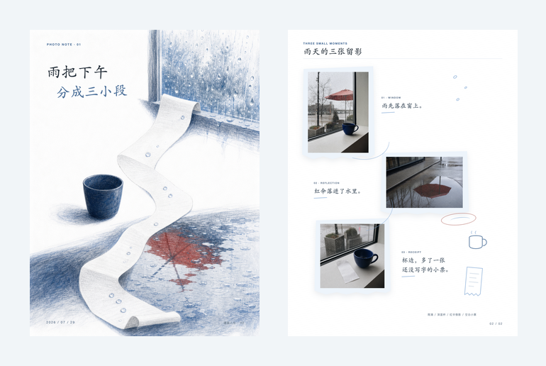
      <br><strong>照片</strong>
      <br>竖图、横图和方图都保留完整。外层可以是手撕纸、异形窗口和随手写下的旁注。
    </td>
  </tr>
  <tr>
    <td width="50%" valign="top">
      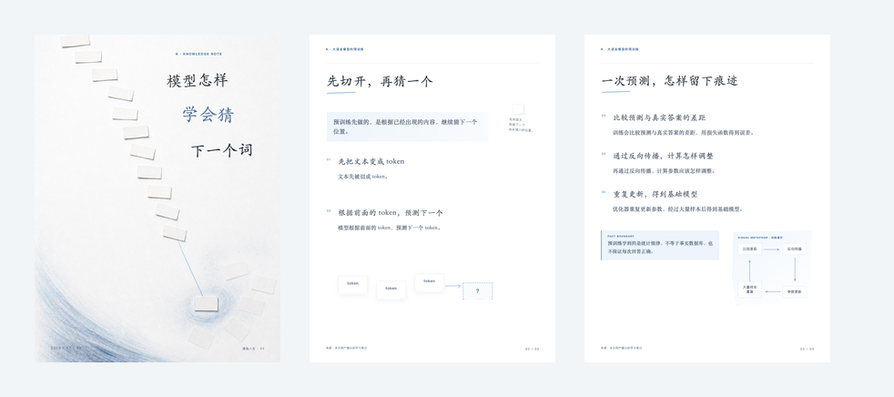
      <br><strong>知识与读书笔记</strong>
      <br>正文先讲清楚。只有关系、过程和尺度难以只靠文字理解时，才加一幅解释图。
    </td>
    <td width="50%" valign="top">
      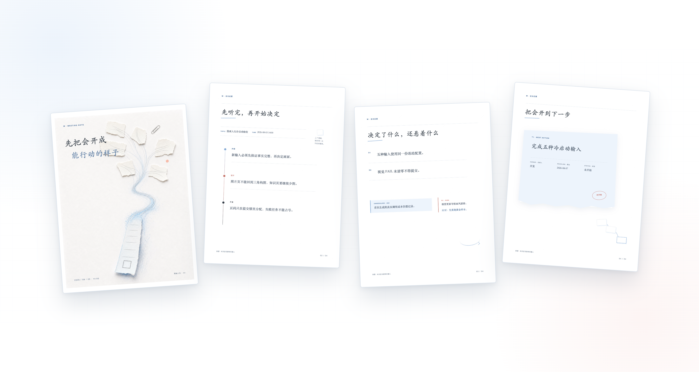
      <br><strong>会议</strong>
      <br>先留下决定、风险、待办、负责人和期限。配图轻一点，不让画面盖过真正要执行的事。
    </td>
  </tr>
  <tr>
    <td colspan="2" valign="top">
      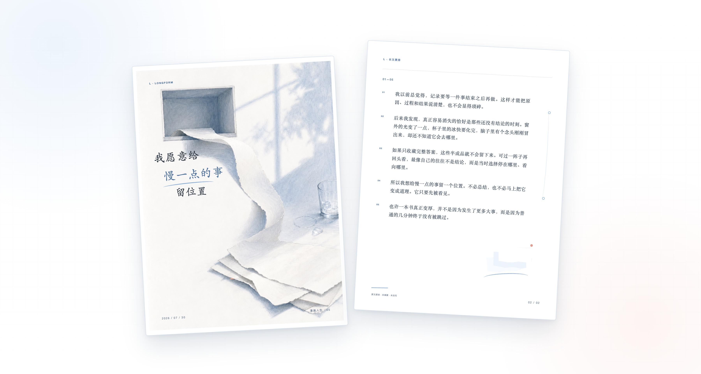
      <br><strong>已经写好的长文</strong>
      <br>不为了“像漫画”而改掉原文。先把文章排得舒服，再让少量插画和纸张材料进入空隙。
    </td>
  </tr>
</table>

## 角色可以主导，也可以只是路过

<table>
  <tr>
    <td width="50%" valign="top">
      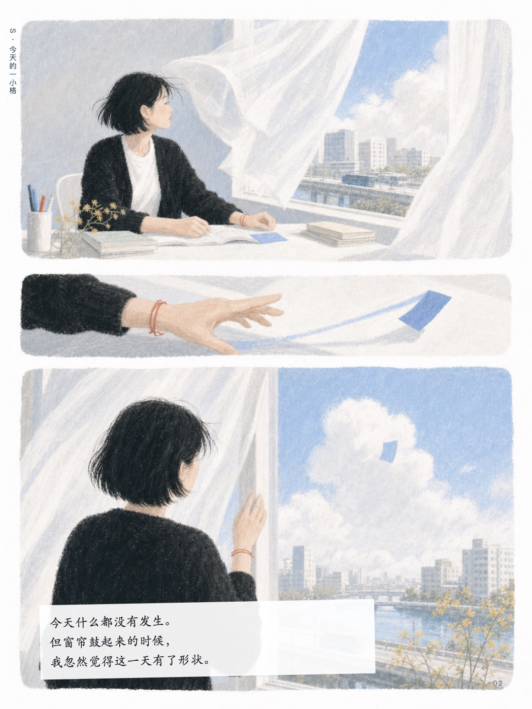
      <br><strong>持续人物</strong>
      <br>有明确人物时，镜头可以跟着她的动作与心情走。人物可辨认，但不需要每页都正面出场。
    </td>
    <td width="50%" valign="top">
      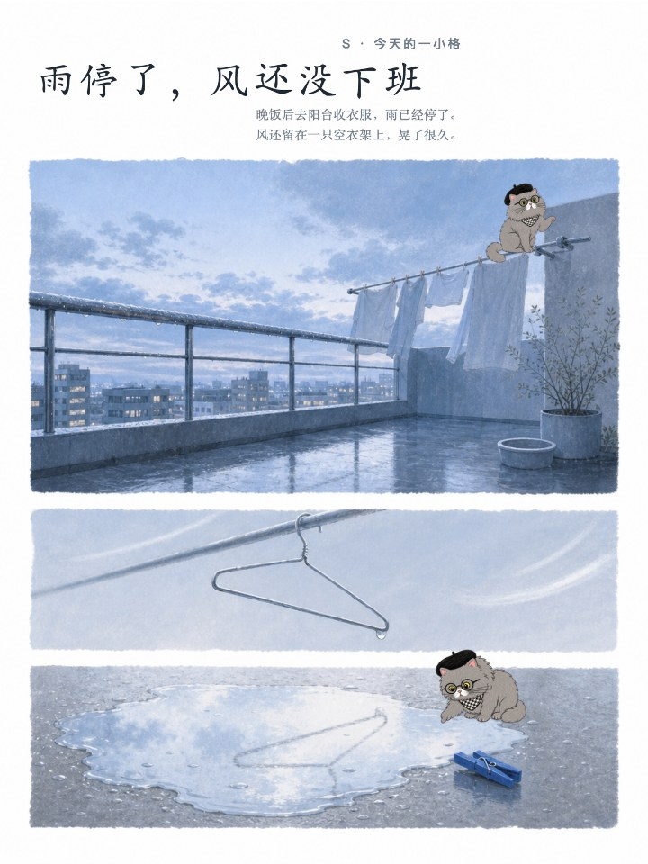
      <br><strong>穿插 IP</strong>
      <br>IP 可以在页边观察，也可以偶尔进入场景。这里的 66 大王是内置的角色示范；你的书会先问要不要带上自己的角色。
    </td>
  </tr>
</table>

## 最后得到的不是一叠散图

<p align="center">
  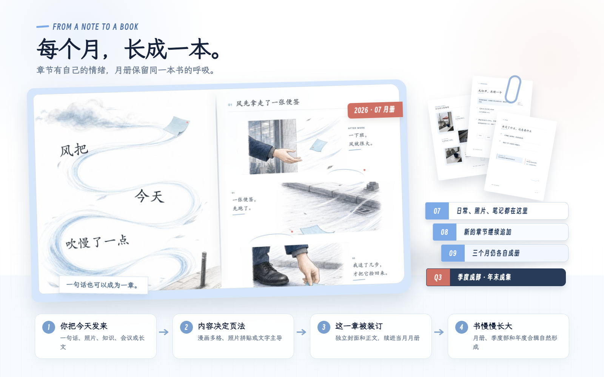
</p>

你把今天发来，内容决定页法。这一章有独立封面和正文，随后被装进当月唯一的连续阅读入口。下个月另起一本月册，三个月形成一部，年末再生成合辑索引。

<p align="center">
  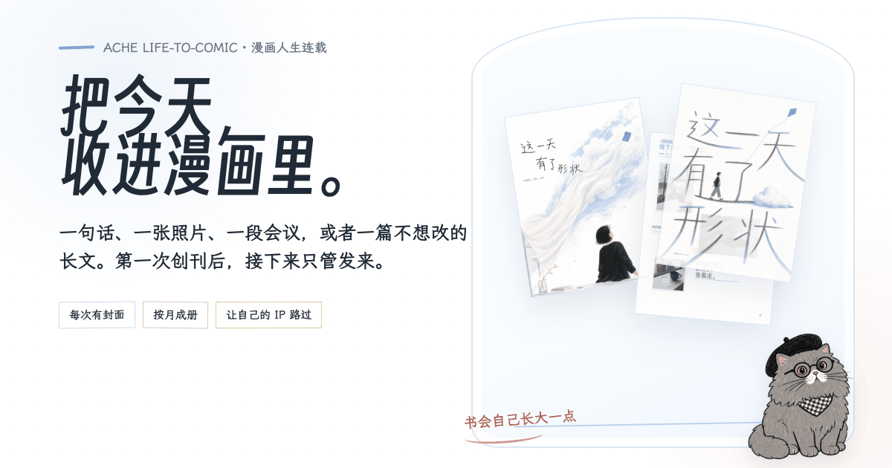
</p>

> [!IMPORTANT]
> 这是一个源码可见、限非商业使用的项目，并非 OSI 定义的开源软件。未经书面许可，不得商用、售卖、代运营交付或作为付费产品的一部分。详见 [LICENSE](./LICENSE)、[视觉资产说明](./ASSET_LICENSE.md) 与 [商业授权](./COMMERCIAL_LICENSING.md)。

## 30 秒开始

```bash
npx skills add https://github.com/acheAIsuiyimen/ache-life-to-comic-skill --skill ache-life-to-comic-skill
```

也可以把这句话直接发给有文件和终端能力的 Agent：

> 帮我安装 `ache-life-to-comic-skill`。从 `https://github.com/acheAIsuiyimen/ache-life-to-comic-skill` 安装后，确认根目录里有 `SKILL.md`、`assets/`、`references/` 和 `scripts/`。

装好后，不需要先学命令。直接说：

> 我想建一本漫画人生。
>
> 把今天的这句话收进去：雨停以后，我在窗边坐了很久。
>
> 这三张照片也续进这个月。
>
> 把这次会议整理进我的漫画月册，但配图简单一点。

## 它会怎么陪你记录

第一次只做四个选择，而且一题一题来：

1. 先看五款画风的同屏样张，也可以上传 1–5 张参考图。
2. 决定要不要让一个熟悉的 IP 偶尔路过。
3. 选择本地 HTML、飞书、GitHub，或先本地再同步。
4. 给这本书起名字。

之后就不再反复填表。你发内容，它负责把这一章续进去。

| 你发来的内容 | 它会怎么处理 |
| --- | --- |
| 日常、心情、朋友圈感受 | 提取真实节拍，做成一至三格漫画或写意页面 |
| 一至多张照片 | 保留完整原图，用异形纸托、手帐边注和漫画节奏重新组织 |
| 知识、读书笔记、心得 | 正文先讲清楚，只在关系、过程或尺度需要时穿插少量解释图 |
| 会议纪要 | 保留决定、风险、待办、负责人和期限，默认轻配图 |
| 已经写好的长文 | 不强行改写，按原顺序排进可读页面，再补少量插画元素 |
| 几种内容一起发 | 判断它们是在说同一件事还是应该拆成不同章节 |

每次正式输入都有自己的章节封面。一个月的内容持续进入同一本月册，每三个月形成一部，年末再生成合辑索引。不是每章散落一个 HTML 文件，也不会因为连载一年就把全部历史塞进上下文。

## 想把 HTML 单独发给别人时

平时连载保留的是可继续修改的 `HTML + assets`，像书稿和插图放在同一个书盒里。单独只发其中的 `index.html`，图片当然不会跟着走。

所以，每次单章、单册、单部或单本完成后，它会问你一次：

- **轻量分享版**：图片与版式已经装进一个 HTML，适合聊天和邮件发送；
- **完整保真版**：连字体也一起装进去，更接近原书，但文件更大；
- **暂不导出**：继续保留可编辑主版本，以后想发时再补导。

选择前会先告诉你预计大小，不会悄悄生成一个几十 MB 的文件。导出的成品放进 `share-exports/`，可以离开原来的 `assets/`，断网单独打开。

## 让自己的 IP 进入漫画

持续角色不是硬性主角。它可以是一只宠物、一个人物、品牌角色、一件总会出现的物品，甚至只是一种背影。

你可以让它：

- 偶尔在页边观察；
- 在某些章节进入场景；
- 只保留固定动作或标志物；
- 完全不出现，让天气、空间和物件来叙事。

示例中的 66 大王只用于展示角色系统。安装到你的书里时，优先问的是“要不要带上你的 IP”，不会把 66 大王自动塞进所有人的故事。

## 五款画风

<p align="center">
  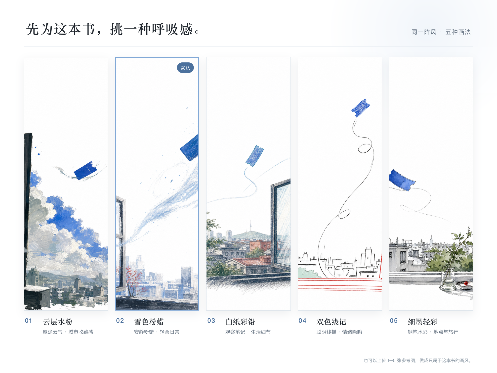
</p>

- `02 雪色粉蜡`：默认。白底、冰蓝、炭灰，安静但不冷淡。
- `01 云层水粉`：更松、更有空气感。
- `03 白纸彩铅`：线条清楚，像认真画过的纸上记录。
- `04 双色线记`：颜色克制，适合轻快日常与物件叙事。
- `05 细墨轻彩`：线稿更稳，适合阅读、知识与长文。

预设只是起点。大多数时候，更推荐上传自己的参考图。Skill 会拆出媒介、配色、人物画法、构图、手帐材料和漫画镜头，不会把参考图里的具体人物或 Logo 顺手抄进来。

## 为什么换个平台，排版不会重新变一遍

比例、字体、白底、分页、照片适配和手帐材料，不再只写成提示词。它们已经落进确定性渲染器：

- `scripts/page-renderer.mjs` 负责 3:4 页面和月册装订；
- `assets/templates/page-system.css` 负责字体、留白、异形窗口与响应式；
- `assets/layout-system/design-baseline.json` 是唯一设计基线；
- `scripts/validate-rendered-html.mjs` 拦截通栏博客、连续大图堆叠、裸会议段落和工具 JSON 泄漏。

不同平台只负责提供文字、原图和无字画面，不能各自重新发明 HTML。图片生成与图片展示也分开探测：如果当前环境没有生图能力，会引导启用原生能力、使用轻插画方案，或先进入待补图队列；不会直接拒绝，也不会假装图片已经出现。

## 记录是怎么长成一本书的

```text
books/
└── your-book/
    ├── publication-profile.json
    ├── episodes/                         # 每次记录的稳定事实与摘要
    ├── monthly-volumes/
    │   └── 2026-07/
    │       └── continuous-edition/
    │           └── index.html            # 当月唯一连续阅读入口
    ├── parts/2026-Q3/                    # 三个月一部，只做索引
    ├── annuals/2026/                     # 年度合辑索引
    └── share-exports/                    # 按需生成的离线单文件
```

同一本书只会越来越厚，不会越用越散。上下文默认只带书级设定、最近五条形式摘要、少量直接相关旧记录和钉住内容，长期连载也不会线性拖慢每次响应。

## 已经写死的质量底线

- 页面默认纯白，不用米黄或牛皮纸铺满背景；
- 中文标题主动平衡换行，不留单字孤行；
- 照片完整保留，外框可以变化，照片本身不被重绘；
- 已经排好的成品页原样装订，不再缩进另一个页面；
- 知识、会议和长文以文字为主，图片少而有用；
- 每章封面跟随这次内容，不复用一个固定构图；
- 桌面、手机、原尺寸和缩略图都要检查；
- 并发追加使用 UUID、书级锁、幂等键和原子写入，避免页码重复或文件损坏。

当前自动化回归为 **62 / 62**。验收内容见 [docs/verification.md](./docs/verification.md)。

## 仓库里有什么

```text
.
├── SKILL.md                       # Skill 入口
├── agents/                        # Agent 界面元数据
├── assets/                        # 画风、角色、字体、模板与设计基线
├── references/                    # 内容路由、角色、记忆、出版与验收规则
├── scripts/                       # 规划、排版、月册、上下文与校验
├── platforms/                     # 平台能力适配契约
├── conformance/                   # 自动化与真实浏览器视觉检查
└── docs/                          # 验收说明和 README 视觉资产
```

## 参与和授权

欢迎提交问题、复现样例和改进建议。代码修改请走 Pull Request，先看 [CONTRIBUTING.md](./CONTRIBUTING.md)。

非商业学习、研究和个人爱好项目可按 [PolyForm Noncommercial 1.0.0](./LICENSE) 使用。商业产品、客户交付、收费课程、代运营、企业内部生产或二次售卖，请先阅读 [COMMERCIAL_LICENSING.md](./COMMERCIAL_LICENSING.md)，再通过 GitHub 联系授权。

66 大王、画风样张、角色锚点、品牌文案和视觉资产不随软件许可自动开放，具体见 [ASSET_LICENSE.md](./ASSET_LICENSE.md)。

---

门可以推，书也可以继续长。素材和 66 大王，不要顺手牵走。
